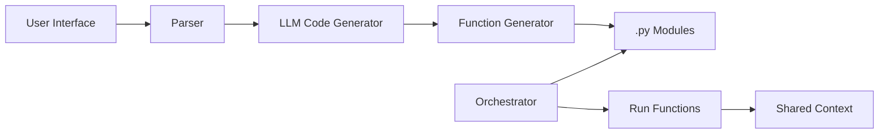

# NL2PyFlow

**Natural Language to Python Flow**

> A pipeline that converts high level natural language blocks into executable Python functions, chained together with a shared context.

---

## Table of Contents

1. [Overview](#overview)
2. [Goals](#goals)
3. [Architecture](#architecture)
4. [Core Components](#core-components)
5. [Data Flow & Context Management](#data-flow--context-management)
6. [LLM Integration](#llm-integration)
7. [Example Workflow](#example-workflow)
8. [Technology Stack](#technology-stack)
9. [Future Extensions](#future-extensions)
10. [Contributing](#contributing)
11. [License](#license)

---

## Overview

NL2PyFlow enables users to author discrete, descriptive blocks in plain English or any other language. An LLM interprets each block and generates corresponding Python functions. An orchestrator then dynamically loads and executes these functions in sequence, sharing data via a unified `context` dictionary.

## Goals

- **Intuitive DSL**: Allow non‑programmers to define workflow steps in natural language.
- **Automated Code Generation**: Use an LLM to translate descriptions into Python functions with a standard signature.
- **Composable Pipeline**: Chain generated functions seamlessly, passing state through a shared `context`.
- **Runtime Execution**: Dynamically assemble and execute the full Python script without manual coding.

## Architecture



1. **User Interface**: Editor or notebook for NL block definitions.
2. **Parser**: Splits text into ordered blocks and labels them (e.g., `block_1`).
3. **LLM Code Generator**: Prompts the LLM to generate each block as a Python function.
4. **Function Generator**: Validates, sanitizes, and writes the generated code to modules.
5. **Orchestrator**: Dynamically imports functions, initializes `context`, and executes each function sequentially.
6. **Context Store**: A Python `dict` carrying inputs, outputs, and intermediate data.

## Core Components

| Component                | Responsibility                                                       |
| ------------------------ | -------------------------------------------------------------------- |
| **Block Definition**     | Natural language descriptions, each as an independent workflow step. |
| **Parser**               | Identifies blocks and prepares prompts for the LLM.                  |
| **LLM Prompt Templates** | Standardizes prompt format and enforces function signature.          |
| **Function Generator**   | Calls the LLM, handles code validation, and writes `.py` files.      |
| **Orchestrator**         | Loads and runs generated functions, managing the shared `context`.   |
| **Error Handler**        | Logs exceptions, diagnostics, and optionally retries or aborts.      |

## Data Flow & Context Management

1. **Initialize**
   ```python
   context = {}
   ```
2. **Block Execution**
   ```python
   def block_n(context: dict) -> dict:
       # generated code
       context['key_n'] = value
       return context
   ```
3. **Chaining**
   - Each block reads and writes to the same `context` dict.
4. **Completion**
   - Final context contains all named outputs for user inspection.

## LLM Integration

**Prompt Template**:

```text
You are a Python expert. Generate a function based on the following description:

Block name: {block_name}
Description: "{block_description}"

Requirements:
- Signature: `def {block_name}(context: dict) -> dict`
- Read from and write to `context`
- Return updated `context`
```

**Validation**:

- Parse with `ast.parse` to ensure syntactic correctness.
- Optionally run unit tests or lint checks before execution.

## Example Workflow

**User Input**:

```markdown
### Block 1: Load data
Load CSV "sales.csv" into a list of records.

### Block 2: Filter high‑value
Filter records with amount > 1000.

### Block 3: Compute total
Sum all amounts and store in `context["total_sales"]`.
```

**Generated Code**:

```python
# block_1.py
def block_1(context: dict) -> dict:
    import csv
    with open("sales.csv") as f:
        context["records"] = list(csv.DictReader(f))
    return context

# block_2.py
def block_2(context: dict) -> dict:
    context["filtered"] = [r for r in context["records"] if float(r["amount"]) > 1000]
    return context

# block_3.py
def block_3(context: dict) -> dict:
    context["total_sales"] = sum(float(r["amount"]) for r in context["filtered"])
    return context
```

**Orchestrator**:

```python
import importlib

def run_pipeline(block_names):
    context = {}
    for name in block_names:
        module = importlib.import_module(name)
        context = getattr(module, name)(context)
    return context

if __name__ == "__main__":
    result = run_pipeline(["block_1", "block_2", "block_3"])
    print(result)
```

## Technology Stack

- **Python**: 3.10+
- **LLM**: OpenAI GPT-4 (or equivalent) API
- **Dynamic Loader**: `importlib` or `exec`
- **Storage**: Local filesystem or database for code & logs
- **UI**: CLI, web editor, or Jupyter Notebook

## Future Extensions

- **Dependency Analysis**: Auto‑derive execution order based on context keys.
- **Parallel Execution**: Run independent blocks concurrently.
- **Version Control**: Track block revisions and enable rollbacks.
- **Schema Validation**: Enforce types in `context` with Pydantic.
- **Visual Debugger**: Interactive inspection of `context` state per block.

## Contributing

Contributions, issues, and feature requests are welcome! Please follow these steps:

1. Fork the repository
2. Create a branch (`git checkout -b feature/XYZ`)
3. Commit your changes (`git commit -m 'Add XYZ'`)
4. Push to the branch (`git push origin feature/XYZ`)
5. Open a Pull Request

## License

This project is licensed under the [Apache License 2.0](LICENSE).

